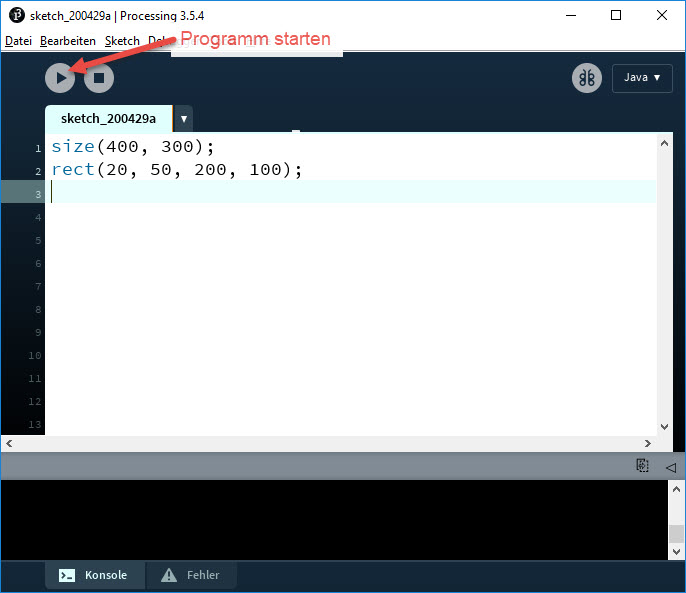

# Entwicklungsumgebung einrichten

Als Programmierumgebung verwenden wir [Processing](https://www.processing.org/). Processing eignet sich hervorragend zum Programmieren von Grafiken und Animationen.

Processing gibt es für Windows, Mac OS X und Linux.

## Processing installieren

Gehe auf die Webseite [https://processing.org/download/](https://processing.org/download/) und lade dort das für dein Betriebssystem passende Paket herunter.

- Für **Windows** erhältst du eine ZIP-Datei. Entpacke das ZIP-Archiv an einen beliebigen Speicherort auf deiner Festplatte, z.B. auf den Desktop oder besser ins Programme-Verzeichnis (_C:\\Program Files_). Doppelklicke danach auf die Datei _processing.exe_, um Processing zu starten.

- Auch für **Mac OS X** handelt es sich um eine ZIP-Datei. Doppelklicke darauf und ziehen das Verarbeitungssymbol in den Anwendungsordner. Doppelklicke auf das Processing-Icon umd Processing zu starten.

- Die **Linux**-Version ist eine .tar.gz-Datei, die den meisten Linux-Benutzern bekannt sein sollte. Lade die Datei in dein Home-Verzeichnis herunter, öffnen ein Terminalfenster und gib folgendes ein (ersetze xxxx durch den Rest des Dateinamens, bei dem es sich um die Versionsnummer handelt):

```bat
    tar xvfz process-xxxx.tgz
```

Dadurch wird ein Ordner mit dem Namen "processing-3.0" oder ähnlich erstellt. Wechsle in dieses Verzeichnis:

```bat
    cd processing-xxxx
```

und führe es aus:

```bat
    ./processing
```

## Erstes Processing-Programm

Zeichne mit Processing ein Rechteck. Starte dazu Processing und gib im Editor folgenden Code ein:

```java
    size(400, 300);
    rect(20,20, 200, 100);
```

Drücke den _Run_-Button in der Toolbar um das Programm zu starten.



### Erklärungen zum Code

- Die Funktion `size(400, 300)` erstellt ein Fenster mit einer Breite von 400 Pixel und einer Höhe von 300 Pixel.

- Die Funktion `rect(20, 50, 200, 100)` zeichnet ein 200 Pixel breites und 100 Pixel hohes Rechteck, dessen linke obere Ecke 20 Pixel vom linken Rand des Fensters und 50 Pixel vom oberen Rand des Fensters entfernt ist.
