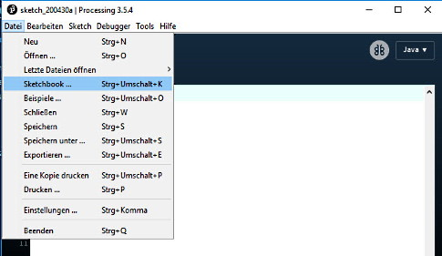
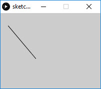
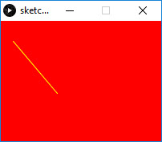
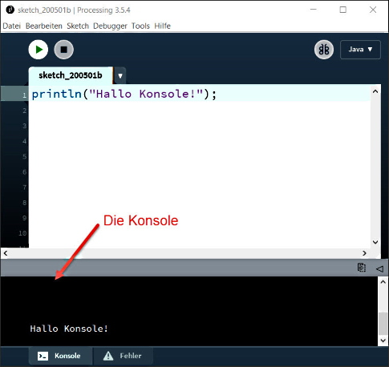
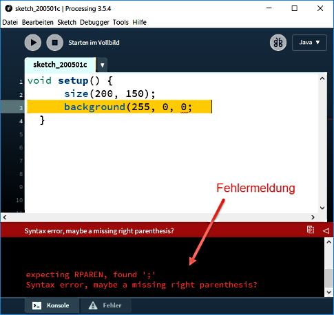

# Einstieg in Processing

_Processing_ ist eine einfache Programmierumgebung, die erstellt wurde, um die Entwicklung visuell orientierter Anwendungen vereinfachen, mit einem Schwerpunkt auf das Erstellen von Animationen. Es wurde ursprünglich als Erweiterung von Java für Künstler und Designer entwickelt und hat sich zu einem umfassenden Design- und Prototyping-Tool entwickelt, das für umfangreiche Animationen und komplexe Datenvisualisierungen verwendet wird.

_Processing_ ist Open Source und kostenlos erhältlich. Die aktuelle Version kann [hier](http://processing.org/download) gedownloadet werden.

## Sketches

Ein Processing-Programm wird als _Sketch_ bezeichnet (deutsch: Skizze). Skechtes werden im sogenannten _Sketchbook_ gespeichert, einem Ordner, der als Standardspeicherort für alle  Processing-Projekte verwendet wird.

Auf Sketches, die im Sketchbook gespeichert sind, kann über das Menu Datei → Sketchbook zugegriffen werden (siehe Bild).

 

## Hello World

Das "Hello World"-Programm bei Processing ist ganz einfach eine Linie zu zeichnen:

```java
    size(200, 150);
    line(15, 25, 70, 90);
```

Gib den Beispiel-Code im Editor von Processing ein starte das Programm mit einem Klick auf das "Starten" Icon. Es wird ein Fenster geöffnet, worin eine schwarze Linie auf grauem Hintergrund gezeichnet wird.

 

Die Funktion `size(200, 150)` erstellt eine Anzeigefenster, das 200 Pixel breit und 150 Pixel hoch ist. Die Funktion `line(15, 25, 70, 90)` zeichnet eine Linie zwischen den beiden Koordinaten (15, 25) und (70, 90), wobei die (0, 0)-Koordinate die obere linke Ecke des Anzeigefensters ist.


### Eine farbige Linie

Natürlich kann mit Processing auch farbig gezeichnet werden.

```java
    size(200, 150);
    background(255, 0, 0);
    stroke(255, 255, 0);
    line(15, 25, 70, 90);
```

Der Beispiel-Code färbt den Hintergrund rot und zeichnet eine gelbe Linie.

 

Die Funktion `background()` ist für die Hintergrundfarbe verantwortlich und die Funktion `stroke()` für die Pinselstrichfarbe. Beiden Funktionen müssen drei Parameter mitgegeben werden. Der erste Parameter steht für die Farbe Rot, der zweite Parameter für die Farbe Grün und der dritte für die Farbe Blau.

### RGB-Farbcodes

Durch Mischen der drei Grundfarben Rot (R), Grün (G) und Blau (B) lassen sich so ziemlich alle Farben darstellen, insgesamt rund 16 Millionen verschiedene Farben.

RGB ist ein additives Farbmodell – das heisst, die Farben werden zueinander addiert. Für jede Grundfarbe, also für Rot, Grün und Blau werden dabei jeweils 8 Bit an Speicher aufgewendet. Daraus ergeben sich für jede der drei Farbenparameter mögliche Werte von 0 bis 255. Bei 0 ist die Farbe nicht vorhanden, bei 255 ist der Farbanteil am stärksten ausgeprägt. Entsprechend erhalten wir für den RGB-Code 0,0,0 **schwarz**. Beim RGB-Code 255,255,255 dagegen sind alle Farbkanäle voll aufgedreht und wir erhalten **weiss**.

**Frage:** Welche Farbe resultiert aus dem RGB-Code 255,0,0 ? 

Im Internet findest du viele Webseiten mit sogenannten Color-Pickern, die dir helfen, den RGB-Code für eine Farbe zu bestimmen, z.B. bei [w3schools.com](https://www.w3schools.com/colors/colors_picker.asp).

## Hello Mouse

Ein Programm, das als eine Liste von Anweisungen geschrieben wurde (wie die vorherigen Beispiele), wird als _statischer_ Sketch bezeichnet. Ein statischer Sketch ergibt ein Bild ohne Animationen oder Interaktionen. Animierte, interaktive Programme werden als eine Reihe von Frames gezeichnet. Sie können erstellt werden, indem die  integrierten Funktionen `setup()` und `draw()` zum Code hinzugefügt werden, wie das folgende Code-Beispiel zeigt.

```java
    void setup() {
        size(200, 150);
        background(255, 0, 0);
        stroke(255, 255, 0);
    }

    void draw() {
        line(mouseX, mouseY, 70, 90);
    }
```

Der `setup()`-Block wird genau einmal ausgeführt (bei Programmstart) und daher für einmalige Initialisierungsanweisungen verwendet, z.B. das Einstellen der Fenstergrösse. Übrigens: Die `size()` Funktion muss **zwingend immer die erste Anweisung** innerhalb von setup() sein!

 Die Funktion `draw()` wird wiederholt, d.h. immer und immer wieder aufgerufen. Sie wird daher für das Erstellen von Animationen verwendet.

Die beiden globalen Variablen `mouseX` und `mouseY` beinhalten die aktuelle Position des Mauszeigers (x-Koordinate und y-Koordinate) innerhalb des Koordinatensystems des Anzeigefensters.

### mousePressed()

Mit der Funktion `mousePressed()` kann auf Mausklicks reagiert werden. Der Code, der innerhalb dieser Funktion programmiert wird, wird immer dann ausgeführt, wenn der Benutzer die Maustaste drückt.

Im folgenden Beispiel wird der Background beim Drücken der Maustaste neu gezeichnet. Damit werden die bis dahin gezeichneten Linien gelöscht (respektive übermalt). 

```java
    void setup() {
        size(200, 150);
        background(255, 0, 0);
        stroke(255, 255, 0);
    }

    void draw() {
        line(mouseX, mouseY, 70, 90);
    }

    void mousePressed() {
       background(255, 0, 0);
     }
```

## Die Konsole

Unterhalb des Editors, wo du deine Processing-Befehle eingibst, befindet sich die _Konsole_.

Mit der Funktion `println()` kann beliebiger Text in die Konsole ausgegeben werden (siehe Bild).



### Fehler

In der Konsole werden auch Fehler angezeigt, die beim Programmieren passieren.

Ein Beispiel:

```java
    void setup() {
        size(200, 150);
        background(255, 0, 0;  
    }
```

Die bei der Funktion _background()_ vergessene Klammer in der 3. Zeile, ein Syntax-Fehler, wird nach Start des Programms in der Konsole gemeldet. Das ist sehr praktisch und hilft enorm bei der Fehlersuche und -behebung.



## Quellenverzeichnis

Der Inhalt und die Beispiele in diesem Kapitel wurden in Teilen der offiziellen Processing-Webseite entnommen, siehe: [Processing Overview](https://processing.org/tutorials/overview/)