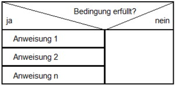
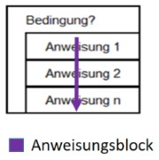

# Grundelemente einer Programmiersprache

Es gibt viele verschiedene Programmiersprachen, die sich alle in Syntax und anderen Dingen mehr oder weniger voneinander unterscheiden. Aber es gibt auch ein paar Grundelemente, die in allen Programmiersprachen sehr ähnlich sind und die sehr wichtig sind für das Verständnis des Programmierens ganz allgemein.

## Anweisungen

Eine Anweisung (auch: _Statement_) ist ein zentrales Element jeder Programmiersprache. Du kannst dir eine Anweisung als einen einzelnen Befehl vorstellen, der auszuführen ist.

Wie eine Anweisung syntaktisch aussehen muss, ist von der Programmiersprache abhängig. Gemeinsam ist vielen Programmiersprachen allerdings, dass eine Anweisung mit dem Strichpunkt (`;`) abgeschlossen werden muss. Auch bei _Processing_ ist das so: 

```java
    println("Hallo Welt!");
```

## Variablen

In Variablen können Daten gespeichert werden. D.h. Variablen sind eine Art Behälter, in den z.B. eine Zahl oder ein Text abgelegt werden kann. Ein abgelegter Wert kann später bei Bedarf aus der Variable herausgeholt werden (auslesen) und man kann in der Variable auch jederzeit einen neuen Wert ablegen (überschreiben).

Damit man eine Variable verwenden kann, muss sie _deklariert_ werden. Normalerweise wird eine Variable durch einen eindeutigen Namen bezeichnet und es wird festgelegt, welche Art von Daten sie aufnehmen kann. Im folgenden Beispiel wird eine Variable mit dem Namen `myNumber` deklariert, in die eine Ganzzahl (`int`) abgelegt werden kann. Nach der Deklaration wird sogleich der Wert 5 in die Variable geschrieben.

```C#
    int myNumber;
    myNumber = 5;
```

## Verzweigungen

Eine Verzweigung ist eine Stelle in einem Programm, wo es unterschiedliche Möglichkeiten gibt, wie das Programm fortfahren soll. Man kann sich das vorstellen, wie an einer Kreuzung, wo zwei Wege weggehen. Welcher Weg genommen wird, hängt davon ab, ob eine bestimmte Bedingung erfüllt (wahr) ist oder nicht. Das folgende Struktogramm veranschaulicht dies.



In den meisten Programmiersprachen werden Verzweigungen mit der `if`-Anweisung realisiert, so auch bei _Processing_:

```java
    double preis = 10.8;
    int alter = 15;

    if (alter < 16) {
        preis = preis / 2;
        println("Sie zahlen den halben Preis.");
    }
```

Wenn die Bedingung nicht erfüllt ist, kann mit `else` ein alternativer Ablauf festgelegt werden:

```java
    double preis = 10.8;
    int alter = 15;

    if (alter < 16) {
        preis = preis / 2;
        println("Sie zahlen den halben Preis.");
    }
    else {
         println("Da Sie älter als 16 sind, zahlen Sie den vollen Preis.");
    }

```

## Schleifen

Eine Schleife verwenden wir, um Wiederholungen im Programm zu realisieren – also um bestimmte Dinge mehrmals zu machen. Dabei hat jede Schleife eine Durchlauf-Bedingung, damit sie nicht endlos läuft. D.h. vor jedem  Durchlauf wird eine Bedingung geprüft und der Anweisungsblock der Schleife wird nur ausgeführt, wenn die Bedingung zutrifft.



Im folgenden Beispiel werden die Anweisungen im `while`-Anweisungsblock nur solange durchlaufen, wie der Wert in der Variablen i kleiner als 10 ist, d.h. sobald i den Wert 10 erreicht, wird die `while`-Schleife nicht mehr ausgeführt.

```java
    int i = 1;

    while (i < 10) {
        println(i);
        i = i + 1;
    }

    println("Fertig.");
```

## Operatoren

Eine Übersicht über die wichtigsten Operatoren.

### Arithmetische Operatoren

Arithmetische Operatoren werden benötigt, um Rechnungen auszuführen.

|  Operator | Beschreibung                                                                                                             |
|:---------:|--------------------------------------------------------------------------------------------------------------------------|
| +         | Additionsoperator, bildet die Summe zweier Operanden (x + y).                                                            |
| -         | Subtraktionsoperator, bildet die Differenz zweier Operanden (x - y).                                                     |
| *         | Multiplikationsoperator, multipliziert zwei Operanden (x * y).                                                           |
| /         | Divisionsoperator, dividiert zwei Operanden (x / y) und behält den Nachkommateil der Division.                           |
| %         | Restwertoperator (Modulo-Operator), dividiert zwei Operanden (x % y) und liefert als Ergebnis den Restwert der Division. |

### Inkrement- bzw. Dekrementoperatoren

Um den Wert einer Variable um eins zu erhöhen bzw. zu reduzieren, kann der Inkrement- `++` bzw. Dekrementoperator `--` verwendet werden.

|  Operator | Beschreibung                          |
|:---------:| --------------------------------------|
| ++        | x++ ist gleichbedeutend mit x = x + 1 |
| --        | x-- ist gleichbedeutend mit x = x - 1 |

### Zuweisungsoperatoren

Bis auf die Ausnahme des einfachen Gleichheitszeichens dienen alle anderen Zuweisungsoperatoren einer verkürzten Schreibweise von Operationen.

|  Operator | Beschreibung                               |
|:---------:|--------------------------------------------|
| =         | x = y weist **x** den Wert von **y** zu.   |
| +=        | x += y weist **x** den Wert von x + y zu.  |
| -=        | x -= y weist **x** den Wert von x - y zu.  |
| *=        | x *= y weist **x** den Wert von x * y zu.  |
| /=        | x /= y weist **x** den Wert von x / y zu.  |
| %=        | x %= y weist **x** den Wert von x % y zu.  |

### Vergleichsoperatoren

Vergleichsoperatoren vergleichen zwei Ausdrücke miteinander. Das Ergebnis ist immer ein boolescher Wert, also entweder `true` oder `false`.

|  Operator | Beschreibung                                                                                          |
|:---------:|-------------------------------------------------------------------------------------------------------|
| a == b    | Ergebnis der Operation ist `true`, wenn der Wert der Variablen a dem Wert der Variablen b entspricht. |
| a != b    | Ergebnis der Operation ist `true`, wenn a ungleich b ist.                                             |
| a > b     | Ergebnis der Operation ist `true`, wenn a grösser als b ist.                                          |
| a < b     | Ergebnis der Operation ist `true`, wenn a kleiner als b ist.                                          |
| a >= b    | Ergebnis der Operation ist `true`, wenn a grösser oder gleich b ist.                                  |
| a <= b    | Ergebnis der Operation ist `true`, wenn a kleiner oder gleich b ist.                                  |

### Logische Operatoren

Logische Operatoren werden benötigt, wenn z. B. eine Bedingung aus zwei zusammengesetzten Teilbedingungen besteht.

|  Operator | Beschreibung                                                                                                                |
|:---------:|-----------------------------------------------------------------------------------------------------------------------------|
| !         | Unärer Negationsoperator. Der Ausdruck `!a` ist `true`, wenn **a** unwahr ist und er ist `false`, wenn **a** wahr ist.      |
| &&        | And-Operator. Der Ausdruck `a && b` ist `true`, wenn sowohl **a** als auch **b**  wahr sind.                                |
| ||        | Or-Operator. Der Ausdruck `a || b` ist `true`, wenn entweder **a** oder **b** wahr ist.                                     |
| ^         | Xor-Operator. Der Ausdruck `a ^ b` ist `true`, wenn die beiden beteiligten Operanden unterschiedliche Wahrheitswerte haben. |

#### Wahrheitstabelle

Die Wahrheitstabelle zeigt auf, welche Ergebnisse die durch die logischen Operatoren verknüpften Ausdrücke haben.

| Bedingung 1 | Bedingung 2 | And-Operator | Or-Operator | Xor-Operator |
|-------------|-------------|--------------|-------------|--------------|
| false       | false       | false        | false       | false        |
| true        | false       | false        | true        | true         |
| false       | true        | false        | true        | true         |
| true        | true        | true         | true        | false        |

## Funktionen (Methoden)

todo
