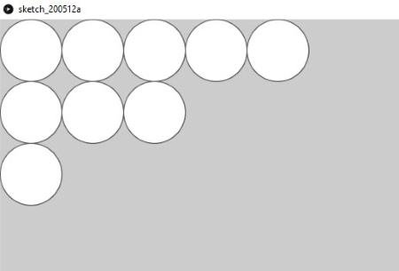
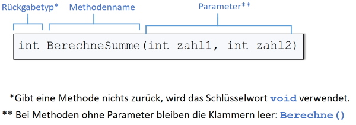

# Methoden (Funktionen)

Eine Methode oder Funktion ist eine Folge von Anweisungen, die unter einem bestimmten Namen aufgerufen werden kann. 

```java
    void doSomething() {
        Anweisung1;
        Anweisung2;
        Anweisung3;
    }
```

Ein konkretes Beispiel könnte eine Methode sein, welche drei Kreise nebeneinander zeichnet:

```java
    void zeichneDreiKreise() {
        circle(50, 50, 100);
        circle(150, 50, 100);
        circle(250, 50, 100);
    }
```

Innerhalb von `setup()` wird diese Methode wie folgt aufgerufen:

```java
    void setup() {
        size(1024, 768);
        zeichneDreiKreise();  // Aufruf der oben definierten Methode
    }
```

Bei der Benennung von Methoden gelten folgende Regeln:

- Der Name soll **aussagekräftig** sein.
- Das erste Wort des Namens soll ein **Verb** sein, (meist) **gefolgt von einem Nomen**, z.B. _berechneSumme()_.

Je nach Programmiersprache wird die Gross-/Klein-Schreibweise von Methodennamen von den Entwicklern unterschiedlich gehandhabt. Es haben sich grundsätzlich zwei unterschiedliche Schreibweisen durchgesetzt:

1. Die **Pascal Case** Schreibweise
    - Erster Buchstabe gross geschrieben und jedes neue Wort mit Grossbuchstaben beginnend.
    - z.B. bei `C#` -> _BerechneSumme()_
2. Die **Camel Case** Schreibweise
    - Erster Buchstabe klein geschrieben und jedes neue Wort mit Grossbuchstaben beginnend.
    - z.B: bei `Java` -> _berechneSumme()_

In unserem Processing-Projekt verwenden wir die Camel Case Schreibweise.

## Nutzen von Methoden

### Strukturierung

Methoden sind ein wichtiges Mittel zur Strukturierung von Quellcode. Dank der Verwendung von Methoden wird der Code leserlicher, wie oben am Beispiel mit den drei Kreisen zu sehen ist. Der Name der Methode (zeichneDreiKreise) ist selbsterklärend; jemand, der den Code liest kann so einfacher und schneller verstehen, was der Code macht.

### Wiederverwendung

Code, der in Methoden ausgelagert wird, ist wiederverwendbar; denn die Methode kann nicht nur einmal, sondern so oft wie es nötig ist und von überall her aufgerufen werden.


## Methoden mit Parametern

Einer Methode können Parameter übergeben werden.

Im folgenden Beispiel nimmt die Methode _zeichneKreise()_  zwei Parameter entgegen. Der erste Paramater bestimmt, wo auf der x-Koordinate die Kreise gezeichnet werden sollen und der zweite Parameter bestimmt, wie viele Kreise gezeichnet werden sollen. 

```java
    void zeichneKreise(int x, int anzahl) {
        for (int i = 0; i < anzahl; i++) {
            circle(50 + i*100, x, 100);
        }
    }

    void setup() {
        size(1024, 768);
        zeichneKreise(50, 5);  
        zeichneKreise(150, 3);  
        zeichneKreise(250, 1);  
    }
```

Kopiere den obigen Code in deine Processing-Umgebung und führe ihn aus. Du solltest das abgebildete Resultat erhalten.



## Methoden mit Rückgabetyp

Mithilfe der `return`-Anweisung ist es möglich, einen Wert, der innerhalb der Methode berechnet wird, an den Aufrufer der Methode zurückzugeben. Dazu muss das Schlüsselwort `void` vor dem Methodennamen ersetzt werden, mit dem Datentyp des Wertes, den die Methode zurückgibt.

Ein Beispiel:

```java
    int berechneSumme(int zahl1, int zahl2) {
        int resultat = zahl1 + zahl2;
        return resultat; // das berechnete Resultat wird an den Aufrufer zurückgegeben
    }

    void setup() {
        size(1024, 768);
        int summe = berechneSumme(25, 5); // das zurückgegebene Resultat wird in die Variable "summe" kopiert
        println("Die Summe ist: " + summe);
    }

```

## Zusammenfassung

