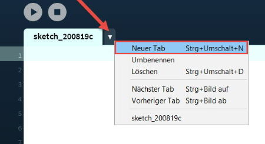
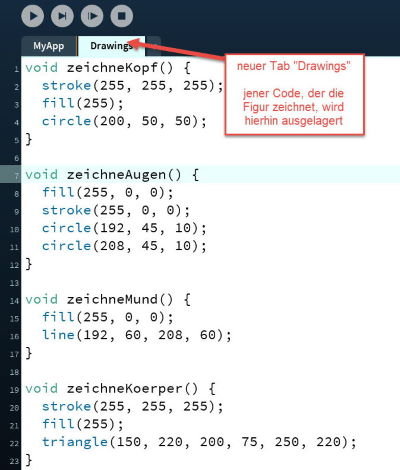
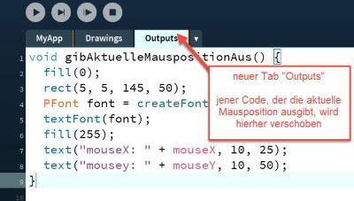

# Code auf Module aufteilen

Wenn du programmierst, kann es mühsam werden, den Code in einem einzigen File abzulegen. Grössere Programme bestehen schnell einmal aus mehreren hundert oder gar tausend Zeilen Code. Um dann den Überblick behalten zu können, macht es Sinn, den Code zu modularisieren. 

> Modularität (auch Baustein- oder Baukastenprinzip) ist die Aufteilung eines Ganzen in Teile, die als Module, Komponenten, Bauelemente, Baugruppen oder Bausteine bezeichnet werden.

Quelle: [Wikipedia](https://de.wikipedia.org/wiki/Modularit%C3%A4t)

## Modulare Programmierung

Ein **Modul** stellt eine abgeschlossene Einheit dar, die bestimmte Funktionen zur Lösung von Aufgaben zur Verfügung stellt. Modulare Programmierung hat den Vorteil, dass der Quelldcode eines Softwareprojektes kontrollierbarer und übersichtlicher wird. Auch die Zusammenarbeit im Team wird durch Modularisierung verbessert; denn Module können einzeln und unabhängig voneinander geplant, programmiert und getestet werden.

## Den Quellcode mit Hilfe von Tabs strukturieren

Processing bietet mit dem Konzept der **Tabs** eine Möglichkeit, den Code aufzuteilen. Ein Tab kann dabei wie ein Modul angesehen werden.

Nutze Tabs, um deinen Quellcode zu strukturieren und übersichtlicher zu gestalten. Achte dabei darauf, dass jeder Tab für die Erledigung einer bestimmten Aufgabe zuständig ist und verschiebe entsprechend nur zusammengehörigen Code in den Tab. Achte ebenso darauf, dass du die Tabs entsprechend benennst: die Namen der Tabs sollten aussagekräftig sein!

Um einen neuen Tab zum Projekt hinzuzufügen, klickst du auf den Pfeil neben dem bestehenden Tab und wählst im Kontext-Menu den Befehl "Neuer Tab". Processing legt für jeden Tab ein neues File an.



### Ein Beispiel

Als Beispiel dient hier ein kleines Programm, das eine Figur mit Augen und Mund zeichnet sowie die aktuelle Position des Mauszeigers auf dem Bildschirm ausgibt. Untenstehend ein Screenprint des Programms sowie der Quellcode dazu.

Abb.: _Screenprint_


_Quellcode:_

```java
void setup() {
  size(400, 300);
}

void draw() {
  // Kopf
  stroke(255, 255, 255);
  fill(255); 
  circle(200, 50, 50);
  
  // Augen
  fill(255, 0, 0);
  stroke(255, 0, 0);
  circle(192, 45, 10);
  circle(208, 45, 10);
  
  // Mund
  fill(255, 0, 0);
  line(192, 60, 208, 60);
  
  // Körper
  stroke(255, 255, 255);
  fill(255); 
  triangle(150, 220, 200, 75, 250, 220);
  
  fill(0);
  rect(5, 5, 145, 50);  
  PFont font = createFont("Verdana", 20); 
  textFont(font); 
  fill(255); 
  text("mouseX: " + mouseX, 10, 25); 
  text("mousey: " + mouseY, 10, 50); 
}
```

#### Aufteilen des Codes auf 3 Tabs

Als erstes lagern wir jenen Code, der für das Zeichnen der Figur zuständig ist, in einen eigenen Tab aus, bennen den Tab entsprechend mit "Drawings" und verschieben dann den Code in diesen Tab. Damit der Code lesbarer wirde, erstellen wir Methoden für das Zeichnen des Kopfes, der Augen, des Mundes sowie des Körpers (_zeichneKopf(), zeichneAugen(), etc_).

Abb.: _Der Tab "Drawings"_



Dann verschieben wir Den Code, der die aktuelle Mausposition am Bildschirm ausgibt, in einen neuen Tab, den wir z.B. "Outputs" nennen.

Abb.: _Der Tab "Outputs"_



Schliesslich sorgen wir dafür, dass innerhalb des ersten Tabs, wo sich die _setup()_ sowie die _draw()_ Methoden befinden, der ausgelagerte Code aufgerufen wird. Hier sieht man jetzt gut den Vorteil von Methoden: eine Methode kann einfach aufgerufen werden und der Code wird leserlicher (selbstbeschreibend!).

Abb.: _Der "Haupt"-Tab mit den Methoden setup() und draw()_


**WICHTIG:** Die beiden Methoden _setup()_ und _draw()_ müssen sich IMMER im ersten Tab befinden. Der erste Tab heisst übrigens immer gleich wie das Projekt, in anderen Worten:  Projektname und Name des ersten Tabs sind immer identisch.
