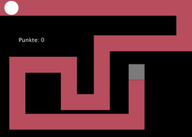

# Ein Geschicklichkeitsspiel programmieren

Dieser Projektauftrag wurde erstellt für die Ausbildung der Lernenden im Basislehrjahr der ICT-Berufsbildung Zentralschweiz.

Ziel ist es, ein Geschicklichkeitsspiel zu entwickeln, in dem eine runde Scheibe mit der Computermaus durch ein 2D-Labyrinth gesteuert wird. Wenn die Scheibe die Wände des Labyrinths berührt, wird sie kleiner. Die Grösse der Scheibe im Ziel bestimmt die erreichte Punktzahl (je kleiner die Scheibe, umso weniger Punkte).

## Programm

| Tag 1                                                      | Tag 2    |Tag 3     |
|------------------------------------------------------------|----------|----------|
| Kick-Off Projektorganisation (Teams, Tools) Sprint 1 | Sprint 2 | Sprint 3 |

## Rahmenbedingungen

### Programmierumgebung

Als Programmiersprache kommt [Processing](https://www.processing.org/) zum Einsatz. Processing eignet sich hervorragend zum Programmieren von Grafiken und Animationen.

### Projektteams

Es wird im Team gearbeitet. Ein Team besteht aus 3 bis 4 Teammitgliedern, die sich gegenseitig beim Lernen unterstützen und das Spiel gemeinsam entwickeln.

### Sprints

Für die Umsetzung der Projektarbeit stehen 22 Std. zur Verfügung. Die zur Verfügung stehende Zeit wird aufgeteilt in 3 Blöcke. Wir nennen diese Blöcke _«Sprints»_. Der erste Sprint dauert 6 Stunden, der 2. und 3. Sprint je 8 Std. Jeder Sprint besteht aus den folgenden Aktivitäten:

- Planning
- Umsetzung
- Review
- Retrospektive

#### Planning

 Das Team legt zu Beginn eines Sprints das Sprint-Ziel fest und erstellt einen Ablaufplan, der beinhaltet wie das Ziel erreicht wird und wer was zur Erreichung des Ziels beiträgt.

 **Für das Planning stehen 30 Minuten zur Verfügung.**

#### Umsetzung

Das Team setzt den Plan um.

#### Review

Das Team prüft am Ende des Sprints den erzielten Fortschritt und präsentiert das erreichte Resultat dem Basislehrjahr-Coach. 

**Für das Review stehen 10 Minuten zur Verfügung.**

#### Retrospektive

In Retrospektive beurteilt das Team gemeinsam die Qualität der Zusammenarbeit während des zurückliegenden Sprints. Dabei leiten die Teammitglieder aus den positiven und negativen Erfahrungen Massnahmen ab, um im nächsten Sprint die Produktivität des Entwicklungsteams zu erhöhen und die Zusammenarbeit im gesamten Team zu verbessern.

**Für die  Retrospektive stehen 20 Minuten zur Verfügung.**
